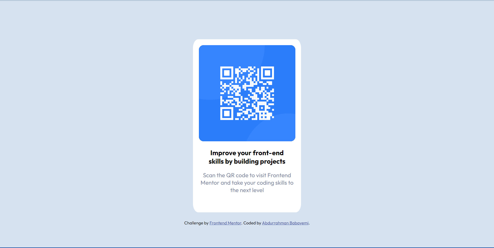

# Frontend Mentor - QR code component solution

This is a solution to the [QR code component challenge on Frontend Mentor](https://www.frontendmentor.io/challenges/qr-code-component-iux_sIO_H). Frontend Mentor challenges help you improve your coding skills by building realistic projects. 

## Table of contents

- [Overview](#overview)
  - [Screenshot](#screenshot)
  - [Links](#links)
- [My process](#my-process)
  - [Built with](#built-with)
  - [What I learned](#what-i-learned)
  - [Continued development](#continued-development)
- [Author](#author)

## Overview

### Screenshot

### Links

- Solution URL: [Github Link](https://github.com/Abdurrahman-thegeniuscoder/qr-code)
- Live Site URL: [Vercel Link](https://qr-code-livid-gamma.vercel.app/)

## My process

### Built with

- Semantic HTML5 markup
- CSS custom properties
- Mobile-first workflow

### What I learned

I had a grip on:
- the box model.
- the use of percentages in width to aid responsiveness. 
- the dynamic usage of border radius.
- the use of the display property.
- the nesting of divs.

### Continued development

- The use of CSS animations.
- The dynamic usage of CSS in general.

## Author

- Website - [Abdurrahman Babayemi](https://abdurrahman-thegeniuscoder.github.io/cv/)
- Frontend Mentor - [@yourusername](https://www.frontendmentor.io/profile/genius-code-124)
- Twitter - [@geniuscode124](https://www.twitter.com/@geniuscode124)
